# Architecture

## High-level system

```mermaid
flowchart TD
  APP[Android App<br/>Flutter + Riverpod] -->|HTTPS / SSE| CF[CloudFront + WAF<br/>edge throttle]
  CF --> ALB[ALB<br/>Cognito OIDC auth]
  CF -->|async/admin| APIGW[API Gateway]
  ALB --> ECS[ECS Fargate<br/>Go monolith x2+]
  APIGW --> LAM[Lambda<br/>metering, model sync, webhooks]
  LAM -.cron.-> EB[EventBridge]
  ECS --> RDS[(RDS PostgreSQL)]
  ECS --> REDIS[(ElastiCache Redis)]
  ECS -->|envelope encrypt/decrypt| KMS[(KMS)]
  ECS --> SECRETS[(Secrets Manager)]
  ECS --> S3[(S3<br/>uploads, exports, backups)]
  LAM --> RDS
  LAM --> S3
  COG[Cognito] -.issues JWT.-> APP
  COG -.OIDC.-> ALB
  CW[CloudWatch + X-Ray] -.logs/metrics.-> ECS
```



ASCII overview (same topology, for terminals):

```
                 Android (Flutter)
                        │ HTTPS (SSE stream)
                        ▼
   Route53 → CloudFront/WAF (edge rate-limit pre-filter)
                        │
              ┌─────────┴──────────┐
              ▼                    ▼
     ALB (Cognito OIDC)      API Gateway
     ─ chat / SSE path ─      ─ async/admin ─
              │                    │
              ▼                    ▼
      ECS Fargate (Go)        Lambda  ◄── EventBridge (cron)
      2+ tasks, ALB HC        (usage metering, model-list
           │                   sync, webhooks, graphify runner)
   ┌────┬────┼─────┬─────┐              │
   ▼    ▼    ▼     ▼     ▼              ▼
 RDS  KMS Redis Secrets  ─────────────► S3
(pg) (keys)(cache)Mgr              (uploads, exports,
  │    ▲                            backups, graphify-out)
  └────┘ envelope-encrypt BYOK keys
```

## Decision record — why ALB (not API Gateway) carries chat

**Problem.** LLM chat UX depends on token-by-token streaming (SSE). API Gateway
(REST and HTTP API) **buffers responses** and enforces a ~29s integration
timeout; it cannot pass SSE through. Routing chat through API Gateway breaks the
core experience.

**Decision.**
- **Chat / SSE path:** `CloudFront/WAF → ALB (native Cognito/OIDC auth) → Fargate`.
  ALB passes SSE through cleanly and performs OIDC authentication natively — no
  custom authorizer code (DRY).
- **Async / admin path:** `API Gateway → Lambda`, for non-streaming triggers
  (webhooks, scheduled ops, model-list refresh). Keeps the "API gateway" intent
  where it fits.

**Revisit if** realtime features beyond streaming chat are needed — then a
WebSocket API (which *can* stream) becomes worth its complexity.

## AWS components

| Service | Role |
|---|---|
| Route 53 | DNS |
| CloudFront + WAF | Edge cache, abuse filter, pre-filter rate limiting |
| Cognito | User pool federated to the single OAuth provider; issues JWT |
| ALB | TLS termination, Cognito/OIDC auth, health checks, SSE passthrough |
| ECS Fargate | Go monolith, ≥2 tasks for HA |
| API Gateway (HTTP API) | Non-streaming endpoints that trigger Lambda |
| Lambda + EventBridge | Async jobs: usage metering, OpenRouter model-list sync, webhooks |
| RDS PostgreSQL | Primary datastore |
| ElastiCache Redis | Model-list cache, identical-prompt cache, per-user rate-limit counters, SSE session coord |
| KMS | Envelope encryption for BYOK provider keys |
| Secrets Manager | DB credentials, OAuth client secret, JWT signing key |
| S3 | Chat file uploads, exports, backups, Terraform state, graphify snapshots |
| CloudWatch + X-Ray | Logs, metrics, alarms, tracing |

## Backend — Go monolith, N-layer

Strict layering: each layer depends only on the one beneath it. Dependencies
point inward toward the domain.

```
backend/
├── cmd/server/main.go          # composition root — wiring only
├── internal/
│   ├── transport/              # HTTP handlers, middleware, SSE writer
│   ├── service/                # use cases: chat, conversations, keys, usage
│   ├── repository/             # sqlc-generated Postgres access
│   ├── provider/               # ChatProvider interface + adapters  ← keystone
│   ├── auth/                   # JWT validation, subject → user mapping
│   ├── crypto/                 # KMS envelope encrypt/decrypt
│   ├── cache/                  # Redis client
│   └── config/                 # env config
├── migrations/                 # golang-migrate
└── go.mod
```

### Provider abstraction (keystone — DRY/SOLID)

One interface; new providers are new adapters (Open–Closed).

```go
type ChatProvider interface {
    Models(ctx context.Context) ([]Model, error)
    Stream(ctx context.Context, req ChatRequest) (<-chan Chunk, error)
}
```

| Adapter | Covers |
|---|---|
| `OpenRouterAdapter` | Free-model default |
| `OpenAICompatAdapter` | **BYOK providers *and* Ollama/vLLM offline** — all speak OpenAI-compatible. One adapter = two features |
| `AnthropicAdapter` | Optional; only if direct Anthropic access is wanted (otherwise route via OpenRouter) |

### Request lifecycle — streamed chat

```
App ──POST /chat (JWT)──► ALB (OIDC verify) ──► Fargate handler
  handler: load user → resolve provider+model → check rate limit (Redis)
         → provider.Stream(ctx, req) → write SSE chunks to ResponseWriter
         → on done: persist message + emit usage event (EventBridge → Lambda)
App ◄──SSE chunks (token-by-token)──
```

- **Rate limiting:** Redis token bucket per `user_id`, checked before the stream
  opens; edge throttle at WAF for burst protection.
- **Usage metering:** fire-and-forget event to Lambda; async write to `usage`
  so streaming latency is unaffected.
- **Cancellation:** client disconnect cancels the upstream context, halting the
  provider stream and stopping token spend.

## Frontend — Flutter (Android)

```
app/lib/
├── presentation/    # screens, widgets
├── application/     # Riverpod providers / notifiers
├── domain/          # entities, repository interfaces
└── data/            # dio client (SSE), secure storage, drift cache
```

| Concern | Approach |
|---|---|
| HTTP + SSE | `dio` streamed response; reconnect + backoff on drop |
| State | `flutter_riverpod` |
| Offline history cache | `drift` (SQLite) |
| Secret storage | `flutter_secure_storage` (Android Keystore) |
| Models | `freezed` + `json_serializable` |
| Navigation | `go_router` |
| Markdown | `flutter_markdown` + code-block highlighting |

## Security

- **BYOK keys** — server-side envelope encryption via KMS; ciphertext in RDS,
  plaintext never logged. Data key per user.
- **Per-user isolation** — every query scoped by `user_id`; no cross-user reads.
- **SQL safety** — `sqlc` emits parameterized code; injection-proof by construction.
- **Transport** — TLS end-to-end (CloudFront/ALB certs); cert pinning in app.
- **Auth** — JWT validated at ALB and re-checked in app middleware.
- **Secrets** — Secrets Manager / SSM Parameter Store, never in repo or plaintext env.
- **Mobile** — OWASP MASVS basics: no hardcoded keys, secure storage, pinned certs.
- **Audit** — auth events and admin actions logged to CloudWatch.

## Cross-cutting

- **Caching** — Redis: provider model lists (refreshed by Lambda), identical-prompt
  response cache (TTL'd), rate-limit counters. In-process caching avoided because
  Fargate runs ≥2 tasks.
- **Observability** — structured logs (zap/slog), CloudWatch metrics/alarms,
  X-Ray tracing across ALB → Fargate → provider.
- **Resilience** — provider calls have timeouts + circuit breakers; provider
  outages degrade gracefully (fall back to next provider/model).
