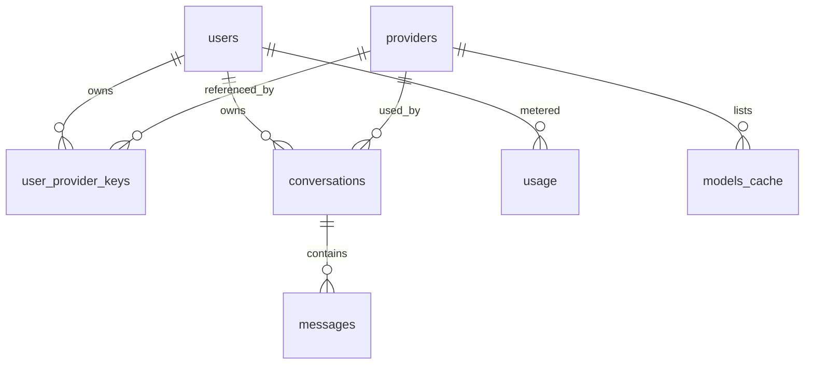

# Data Model

PostgreSQL is the only operational datastore. Schema is managed with
`golang-migrate`; access code is generated by `sqlc` (type-safe, parameterized).

## Entity relationships

## Tables

### `users`
Application user. `cognito_sub` is the immutable identity from Cognito used to
resolve the JWT subject to an internal `user_id`.

| Column | Type | Notes |
|---|---|---|
| `id` | `uuid` PK | `gen_random_uuid()` |
| `email` | `citext` | unique, not null |
| `cognito_sub` | `text` | unique, not null — JWT `sub` claim |
| `created_at` | `timestamptz` | default `now()` |

### `providers`
Catalog of supported provider kinds. Seed data, not user-editable.

| Column | Type | Notes |
|---|---|---|
| `id` | `uuid` PK | |
| `name` | `text` | `openrouter`, `openai`, `anthropic`, `ollama`, … |
| `base_url` | `text` | default endpoint |
| `kind` | `text` | `openrouter` \| `openai_compat` \| `anthropic` |

### `user_provider_keys`
A user's BYOK credentials. **Ciphertext only** — encrypted server-side via KMS
envelope encryption.

| Column | Type | Notes |
|---|---|---|
| `user_id` | `uuid` FK → users | composite PK with `provider_id` |
| `provider_id` | `uuid` FK → providers | |
| `ciphertext_key` | `bytea` | KMS-encrypted API key |
| `label` | `text` | user-facing nickname |
| `created_at` | `timestamptz` | |

> Plaintext is never persisted or logged. Decryption happens in-process per
> request using a per-user KMS data key.

### `conversations`
A chat thread.

| Column | Type | Notes |
|---|---|---|
| `id` | `uuid` PK | |
| `user_id` | `uuid` FK → users | indexed |
| `title` | `text` | user-set or auto-derived |
| `provider_id` | `uuid` FK → providers | |
| `model_id` | `text` | provider-specific model identifier |
| `created_at` | `timestamptz` | |
| `updated_at` | `timestamptz` | bump on new message |

### `messages`
One turn in a conversation.

| Column | Type | Notes |
|---|---|---|
| `id` | `uuid` PK | |
| `conversation_id` | `uuid` FK → conversations | indexed |
| `role` | `text` | `system` \| `user` \| `assistant` |
| `content` | `text` | rendered markdown for assistant |
| `tokens_in` | `int` | prompt tokens (assistant rows) |
| `tokens_out` | `int` | completion tokens |
| `created_at` | `timestamptz` | |

### `usage`
Per-user metering, aggregated by period. Written asynchronously by Lambda.

| Column | Type | Notes |
|---|---|---|
| `user_id` | `uuid` FK → users | composite PK with `period` |
| `period` | `date` | day granularity |
| `tokens_in` | `bigint` | |
| `tokens_out` | `bigint` | |
| `request_count` | `int` | |
| `updated_at` | `timestamptz` | |

### `models_cache`
Provider model catalog, kept fresh by the Lambda sync job.

| Column | Type | Notes |
|---|---|---|
| `provider_id` | `uuid` FK → providers | composite PK with `model_id` |
| `model_id` | `text` | |
| `name` | `text` | display name |
| `context_window` | `int` | max input tokens |
| `is_free` | `bool` | OpenRouter free-tier flag |
| `updated_at` | `timestamptz` | |

## Indexing

- `users(cognito_sub)` — JWT lookup (unique)
- `conversations(user_id, updated_at desc)` — conversation list
- `messages(conversation_id, created_at)` — message history
- `usage(user_id, period)` — metering reads (PK)

## Conventions

- All PKs are `uuid`; all timestamps are `timestamptz`.
- Every user-scoped table enforces isolation by requiring `user_id` in lookups;
  repository queries always filter `WHERE user_id = $1`.
- Migrations are forward-only and reviewed in PRs; `sqlc` regenerates access code
  from the updated schema in the same PR.
